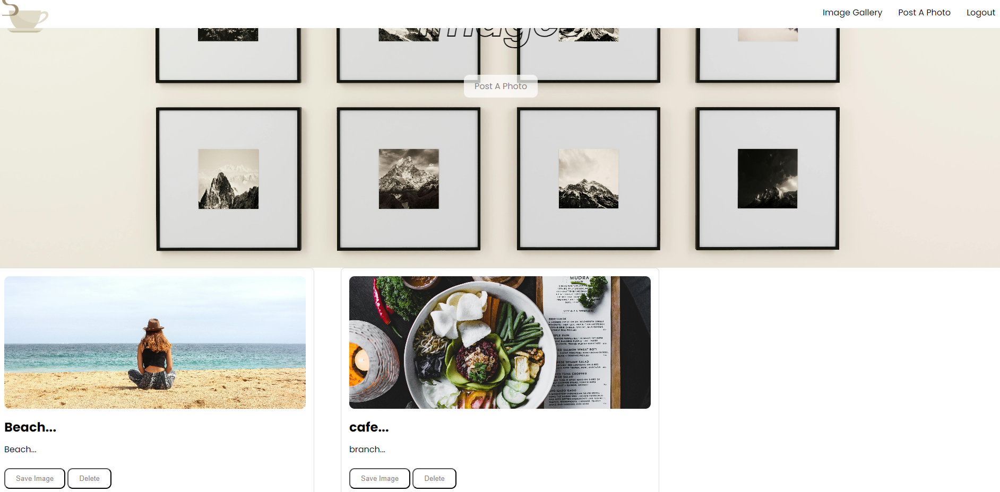

  <h2 align="center">Blog App</h2>

The photo gallery app with image searching functionality is built using HTML, CSS, and JavaScript.

### Demo Screeshots



### Prerequisites

Make sure you have the following installed:

Node.js (version 14 or higher)

### Run Locally

To run **Blog-app** locally, run this command on your git bash:

Linux and macOS:

````bash
sudo git clone https://github.com/Maria0920/Photo-Gallery

Windows:

```bash
git clone https://github.com/Maria0920/Photo-Gallery
````

### Installation

1, Navigate to the project directory and install the required Node.js packages:

````bash
Code: npm install
Start the Server

2, Run the following command to start the Express server:

```bash
Code: npm start
By default, the server will run on http://localhost:3000. You can access the blog site by navigating to this URL in your web browser.

Usage
Blog Management: Use the provided HTML forms to create, update, and delete blog posts.
Image Searching: Use the search functionality to find images based on keywords.
````

### License

This project is licensed under the MIT License - see the LICENSE file for details.
